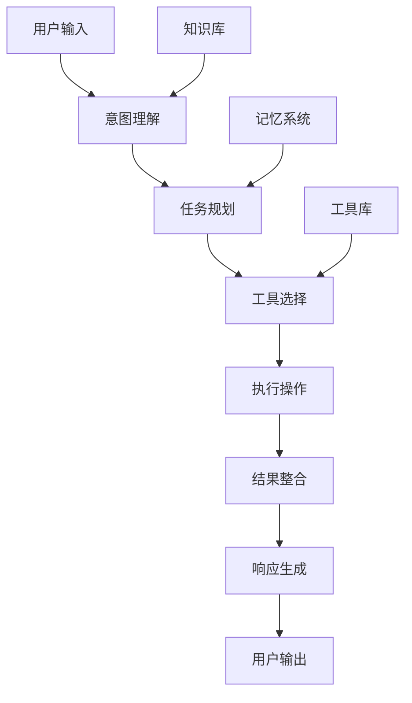

# 智能体开发介绍

智能体（Agent）是基于大语言模型构建的智能应用，能够理解用户意图、调用外部工具、执行复杂任务的智能系统。智谱AI开放平台提供了丰富的工具和能力，帮助开发者构建强大的智能体应用。

## 什么是智能体

智能体是一个能够：
- **理解用户意图**：通过自然语言理解用户的需求
- **制定执行计划**：根据任务目标制定合理的执行步骤
- **调用外部工具**：使用各种API和服务完成具体任务
- **处理复杂逻辑**：处理多步骤、多条件的复杂业务逻辑
- **持续学习优化**：根据反馈不断改进执行效果

## 智能体的核心组件

### 1. 大语言模型
作为智能体的"大脑"，负责理解、推理和生成

### 2. 工具调用能力
- 网络搜索
- 函数调用
- 代码执行
- 文档检索
- 图像生成

### 3. 记忆系统
- 短期记忆：对话上下文
- 长期记忆：知识库、历史经验

### 4. 规划与执行
- 任务分解
- 步骤规划
- 执行监控
- 结果评估

## 智能体的应用场景

### 客服助手
- 自动回答常见问题
- 处理复杂客户咨询
- 工单创建和跟踪

### 内容创作
- 文章写作
- 营销文案
- 代码生成
- 图像设计

### 数据分析
- 报表生成
- 趋势分析
- 数据可视化
- 业务洞察

### 办公助手
- 会议纪要
- 邮件处理
- 日程安排
- 文档整理

## 开发流程

### 1. 需求分析
- 明确智能体的目标用户
- 定义核心功能和使用场景
- 确定所需的工具和能力

### 2. 设计架构
- 选择合适的模型
- 设计工具调用流程
- 规划数据存储方案

### 3. 实现开发
- 配置模型参数
- 集成外部工具
- 实现业务逻辑

### 4. 测试优化
- 功能测试
- 性能优化
- 用户体验改进

### 5. 部署运维
- 生产环境部署
- 监控和日志
- 持续优化

## 最佳实践

### Prompt设计
- 清晰的角色定义
- 具体的任务描述
- 明确的输出格式
- 合理的约束条件

### 工具集成
- 选择可靠的API服务
- 实现错误处理机制
- 优化调用性能
- 确保数据安全

### 用户体验
- 友好的交互界面
- 及时的反馈机制
- 清晰的操作指引
- 个性化的服务

## 技术架构

## 开始构建

准备好开始构建您的智能体了吗？请查看以下指南：

- [网络搜索](/cn/guide/agent/web-search) - 让智能体具备实时信息获取能力
- [函数调用](/cn/guide/agent/function-calling) - 集成外部API和服务
- [文档检索](/cn/guide/agent/retrieval) - 构建知识库检索能力
- [代码执行](/cn/guide/agent/code-interpreter) - 让智能体能够编写和执行代码
- [图像生成](/cn/guide/agent/drawing) - 集成图像创作能力
- [JSON模式](/cn/guide/agent/json-mode) - 结构化输出控制

<Tip>
建议从简单的功能开始，逐步增加复杂性。先确保基础功能稳定可靠，再添加高级特性。
</Tip>