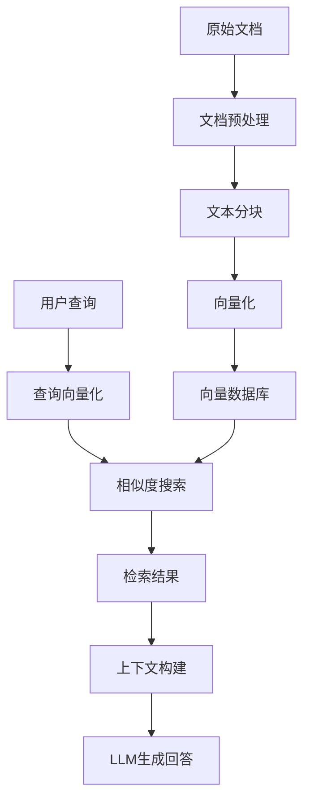

# 文档检索

文档检索（Retrieval）是智能体获取特定领域知识的重要能力，通过向量化技术和语义搜索，让AI能够从大量文档中快速找到相关信息，提供准确的知识问答服务。

## 功能特性

### 语义搜索
- 基于向量相似度的语义匹配
- 支持多语言文档检索
- 智能理解用户查询意图
- 模糊匹配和同义词识别

### 多格式支持
- PDF文档
- Word文档
- Markdown文件
- 纯文本文件
- 网页内容
- 结构化数据

### 高效索引
- 文档分块处理
- 向量化存储
- 快速检索响应
- 增量更新支持

## 系统架构



## 实现步骤

### 1. 文档预处理

```python
import os
import re
from typing import List, Dict
from pathlib import Path

class DocumentProcessor:
    def __init__(self):
        self.supported_formats = ['.txt', '.md', '.pdf', '.docx']
    
    def load_document(self, file_path: str) -> str:
        """
        加载文档内容
        """
        file_ext = Path(file_path).suffix.lower()
        
        if file_ext == '.txt' or file_ext == '.md':
            return self._load_text_file(file_path)
        elif file_ext == '.pdf':
            return self._load_pdf_file(file_path)
        elif file_ext == '.docx':
            return self._load_docx_file(file_path)
        else:
            raise ValueError(f"不支持的文件格式: {file_ext}")
    
    def _load_text_file(self, file_path: str) -> str:
        """
        加载文本文件
        """
        with open(file_path, 'r', encoding='utf-8') as f:
            return f.read()
    
    def _load_pdf_file(self, file_path: str) -> str:
        """
        加载PDF文件
        """
        try:
            import PyPDF2
            with open(file_path, 'rb') as f:
                reader = PyPDF2.PdfReader(f)
                text = ""
                for page in reader.pages:
                    text += page.extract_text() + "\n"
                return text
        except ImportError:
            raise ImportError("请安装PyPDF2: pip install PyPDF2")
    
    def _load_docx_file(self, file_path: str) -> str:
        """
        加载Word文档
        """
        try:
            from docx import Document
            doc = Document(file_path)
            text = ""
            for paragraph in doc.paragraphs:
                text += paragraph.text + "\n"
            return text
        except ImportError:
            raise ImportError("请安装python-docx: pip install python-docx")
    
    def clean_text(self, text: str) -> str:
        """
        清理文本内容
        """
        # 移除多余的空白字符
        text = re.sub(r'\s+', ' ', text)
        # 移除特殊字符
        text = re.sub(r'[^\w\s\u4e00-\u9fff.,!?;:()\[\]{}"\'-]', '', text)
        # 移除空行
        text = re.sub(r'\n\s*\n', '\n', text)
        return text.strip()
```

### 2. 文档分块

```python
class TextChunker:
    def __init__(self, chunk_size: int = 500, overlap: int = 50):
        self.chunk_size = chunk_size
        self.overlap = overlap
    
    def chunk_text(self, text: str, metadata: Dict = None) -> List[Dict]:
        """
        将文本分割成块
        """
        chunks = []
        sentences = self._split_into_sentences(text)
        
        current_chunk = ""
        current_length = 0
        
        for sentence in sentences:
            sentence_length = len(sentence)
            
            if current_length + sentence_length > self.chunk_size and current_chunk:
                # 保存当前块
                chunks.append({
                    'content': current_chunk.strip(),
                    'metadata': metadata or {},
                    'length': current_length
                })
                
                # 开始新块，保留重叠部分
                overlap_text = self._get_overlap_text(current_chunk)
                current_chunk = overlap_text + sentence
                current_length = len(current_chunk)
            else:
                current_chunk += sentence
                current_length += sentence_length
        
        # 添加最后一块
        if current_chunk.strip():
            chunks.append({
                'content': current_chunk.strip(),
                'metadata': metadata or {},
                'length': current_length
            })
        
        return chunks
    
    def _split_into_sentences(self, text: str) -> List[str]:
        """
        将文本分割成句子
        """
        # 简单的句子分割，可以使用更复杂的NLP库
        sentences = re.split(r'[.!?。！？]\s+', text)
        return [s.strip() + '.' for s in sentences if s.strip()]
    
    def _get_overlap_text(self, text: str) -> str:
        """
        获取重叠文本
        """
        words = text.split()
        if len(words) <= self.overlap:
            return text
        return ' '.join(words[-self.overlap:]) + ' '
```

### 3. 向量化和存储

```python
import numpy as np
import requests
import json
from typing import List, Dict, Tuple

class VectorStore:
    def __init__(self, api_key: str):
        self.api_key = api_key
        self.embeddings_url = "https://open.bigmodel.cn/api/paas/v4/embeddings"
        self.chunks = []
        self.vectors = []
    
    def get_embedding(self, text: str) -> List[float]:
        """
        获取文本的向量表示
        """
        headers = {
            "Content-Type": "application/json",
            "Authorization": f"Bearer {self.api_key}"
        }
        
        data = {
            "model": "embedding-2",
            "input": text
        }
        
        response = requests.post(self.embeddings_url, headers=headers, json=data)
        result = response.json()
        
        if 'data' in result and len(result['data']) > 0:
            return result['data'][0]['embedding']
        else:
            raise ValueError(f"获取向量失败: {result}")
    
    def add_chunks(self, chunks: List[Dict]):
        """
        添加文档块到向量库
        """
        for chunk in chunks:
            try:
                # 获取向量
                vector = self.get_embedding(chunk['content'])
                
                # 存储
                self.chunks.append(chunk)
                self.vectors.append(vector)
                
                print(f"已添加文档块: {chunk['content'][:50]}...")
            except Exception as e:
                print(f"处理文档块失败: {e}")
    
    def search(self, query: str, top_k: int = 5) -> List[Tuple[Dict, float]]:
        """
        搜索相关文档块
        """
        if not self.vectors:
            return []
        
        # 获取查询向量
        query_vector = self.get_embedding(query)
        
        # 计算相似度
        similarities = []
        for i, vector in enumerate(self.vectors):
            similarity = self._cosine_similarity(query_vector, vector)
            similarities.append((i, similarity))
        
        # 排序并返回top_k结果
        similarities.sort(key=lambda x: x[1], reverse=True)
        
        results = []
        for i, similarity in similarities[:top_k]:
            results.append((self.chunks[i], similarity))
        
        return results
    
    def _cosine_similarity(self, vec1: List[float], vec2: List[float]) -> float:
        """
        计算余弦相似度
        """
        vec1 = np.array(vec1)
        vec2 = np.array(vec2)
        
        dot_product = np.dot(vec1, vec2)
        norm1 = np.linalg.norm(vec1)
        norm2 = np.linalg.norm(vec2)
        
        if norm1 == 0 or norm2 == 0:
            return 0
        
        return dot_product / (norm1 * norm2)
    
    def save_to_file(self, file_path: str):
        """
        保存向量库到文件
        """
        data = {
            'chunks': self.chunks,
            'vectors': self.vectors
        }
        
        with open(file_path, 'w', encoding='utf-8') as f:
            json.dump(data, f, ensure_ascii=False, indent=2)
    
    def load_from_file(self, file_path: str):
        """
        从文件加载向量库
        """
        with open(file_path, 'r', encoding='utf-8') as f:
            data = json.load(f)
        
        self.chunks = data['chunks']
        self.vectors = data['vectors']
```

### 4. 检索问答系统

```python
class RetrievalQA:
    def __init__(self, api_key: str, vector_store: VectorStore):
        self.api_key = api_key
        self.vector_store = vector_store
        self.chat_url = "https://open.bigmodel.cn/api/paas/v4/chat/completions"
    
    def answer_question(self, question: str, top_k: int = 3) -> Dict:
        """
        基于检索的问答
        """
        # 检索相关文档
        search_results = self.vector_store.search(question, top_k)
        
        if not search_results:
            return {
                "answer": "抱歉，我没有找到相关信息来回答您的问题。",
                "sources": [],
                "confidence": 0.0
            }
        
        # 构建上下文
        context = self._build_context(search_results)
        
        # 生成回答
        answer = self._generate_answer(question, context)
        
        # 提取来源信息
        sources = [{
            "content": result[0]['content'][:100] + "...",
            "similarity": result[1],
            "metadata": result[0].get('metadata', {})
        } for result in search_results]
        
        return {
            "answer": answer,
            "sources": sources,
            "confidence": search_results[0][1] if search_results else 0.0
        }
    
    def _build_context(self, search_results: List[Tuple[Dict, float]]) -> str:
        """
        构建上下文信息
        """
        context_parts = []
        for i, (chunk, similarity) in enumerate(search_results):
            context_parts.append(f"参考资料{i+1}:\n{chunk['content']}\n")
        
        return "\n".join(context_parts)
    
    def _generate_answer(self, question: str, context: str) -> str:
        """
        基于上下文生成回答
        """
        prompt = f"""基于以下参考资料回答问题。如果参考资料中没有相关信息，请明确说明。

参考资料：
{context}

问题：{question}

请提供准确、详细的回答："""
        
        headers = {
            "Content-Type": "application/json",
            "Authorization": f"Bearer {self.api_key}"
        }
        
        data = {
            "model": "glm-4-plus",
            "messages": [
                {"role": "user", "content": prompt}
            ],
            "temperature": 0.1
        }
        
        response = requests.post(self.chat_url, headers=headers, json=data)
        result = response.json()
        
        if 'choices' in result and len(result['choices']) > 0:
            return result['choices'][0]['message']['content']
        else:
            return "生成回答时出现错误。"
```

## 完整使用示例

```python
def main():
    api_key = "your_api_key"
    
    # 初始化组件
    processor = DocumentProcessor()
    chunker = TextChunker(chunk_size=500, overlap=50)
    vector_store = VectorStore(api_key)
    
    # 处理文档
    documents = [
        "/path/to/document1.pdf",
        "/path/to/document2.md",
        "/path/to/document3.txt"
    ]
    
    for doc_path in documents:
        try:
            print(f"处理文档: {doc_path}")
            
            # 加载和清理文档
            content = processor.load_document(doc_path)
            clean_content = processor.clean_text(content)
            
            # 分块
            chunks = chunker.chunk_text(clean_content, {
                "source": doc_path,
                "type": "document"
            })
            
            # 添加到向量库
            vector_store.add_chunks(chunks)
            
        except Exception as e:
            print(f"处理文档 {doc_path} 失败: {e}")
    
    # 保存向量库
    vector_store.save_to_file("knowledge_base.json")
    
    # 初始化问答系统
    qa_system = RetrievalQA(api_key, vector_store)
    
    # 问答示例
    questions = [
        "什么是人工智能？",
        "机器学习的主要算法有哪些？",
        "深度学习和传统机器学习的区别是什么？"
    ]
    
    for question in questions:
        print(f"\n问题: {question}")
        result = qa_system.answer_question(question)
        print(f"回答: {result['answer']}")
        print(f"置信度: {result['confidence']:.2f}")
        print("来源:")
        for i, source in enumerate(result['sources']):
            print(f"  {i+1}. {source['content']} (相似度: {source['similarity']:.2f})")

if __name__ == "__main__":
    main()
```

## 高级功能

### 1. 多模态检索

```python
class MultiModalRetrieval:
    def __init__(self, api_key: str):
        self.api_key = api_key
        self.text_store = VectorStore(api_key)
        self.image_descriptions = {}
    
    def add_image_with_description(self, image_path: str, description: str):
        """
        添加图像及其描述
        """
        self.image_descriptions[image_path] = description
        
        # 将描述添加到文本向量库
        chunk = {
            'content': description,
            'metadata': {
                'type': 'image_description',
                'image_path': image_path
            }
        }
        self.text_store.add_chunks([chunk])
    
    def search_multimodal(self, query: str, top_k: int = 5):
        """
        多模态搜索
        """
        results = self.text_store.search(query, top_k)
        
        formatted_results = []
        for chunk, similarity in results:
            result = {
                'content': chunk['content'],
                'similarity': similarity,
                'type': chunk['metadata'].get('type', 'text')
            }
            
            if result['type'] == 'image_description':
                result['image_path'] = chunk['metadata']['image_path']
            
            formatted_results.append(result)
        
        return formatted_results
```

### 2. 增量更新

```python
class IncrementalVectorStore(VectorStore):
    def __init__(self, api_key: str):
        super().__init__(api_key)
        self.chunk_hashes = set()
    
    def _get_chunk_hash(self, content: str) -> str:
        """
        计算文档块的哈希值
        """
        import hashlib
        return hashlib.md5(content.encode()).hexdigest()
    
    def add_chunks(self, chunks: List[Dict]):
        """
        增量添加文档块（避免重复）
        """
        new_chunks = []
        for chunk in chunks:
            chunk_hash = self._get_chunk_hash(chunk['content'])
            if chunk_hash not in self.chunk_hashes:
                new_chunks.append(chunk)
                self.chunk_hashes.add(chunk_hash)
        
        if new_chunks:
            super().add_chunks(new_chunks)
            print(f"添加了 {len(new_chunks)} 个新文档块")
        else:
            print("没有新的文档块需要添加")
    
    def update_document(self, doc_path: str, processor: DocumentProcessor, chunker: TextChunker):
        """
        更新单个文档
        """
        # 移除旧的文档块
        self._remove_document_chunks(doc_path)
        
        # 添加新的文档块
        content = processor.load_document(doc_path)
        clean_content = processor.clean_text(content)
        chunks = chunker.chunk_text(clean_content, {"source": doc_path})
        self.add_chunks(chunks)
    
    def _remove_document_chunks(self, doc_path: str):
        """
        移除指定文档的所有块
        """
        indices_to_remove = []
        for i, chunk in enumerate(self.chunks):
            if chunk.get('metadata', {}).get('source') == doc_path:
                indices_to_remove.append(i)
        
        # 从后往前删除，避免索引变化
        for i in reversed(indices_to_remove):
            chunk_hash = self._get_chunk_hash(self.chunks[i]['content'])
            self.chunk_hashes.discard(chunk_hash)
            del self.chunks[i]
            del self.vectors[i]
```

### 3. 查询扩展

```python
class QueryExpansion:
    def __init__(self, api_key: str):
        self.api_key = api_key
        self.chat_url = "https://open.bigmodel.cn/api/paas/v4/chat/completions"
    
    def expand_query(self, original_query: str) -> List[str]:
        """
        扩展查询词
        """
        prompt = f"""请为以下查询生成3-5个相关的同义词查询或相关查询，用于提高搜索召回率。

原始查询：{original_query}

请生成相关查询（每行一个）："""
        
        headers = {
            "Content-Type": "application/json",
            "Authorization": f"Bearer {self.api_key}"
        }
        
        data = {
            "model": "glm-4-plus",
            "messages": [{"role": "user", "content": prompt}],
            "temperature": 0.3
        }
        
        response = requests.post(self.chat_url, headers=headers, json=data)
        result = response.json()
        
        if 'choices' in result:
            expanded_text = result['choices'][0]['message']['content']
            queries = [q.strip() for q in expanded_text.split('\n') if q.strip()]
            return [original_query] + queries
        
        return [original_query]
    
    def search_with_expansion(self, vector_store: VectorStore, query: str, top_k: int = 5):
        """
        使用查询扩展进行搜索
        """
        expanded_queries = self.expand_query(query)
        all_results = []
        
        for expanded_query in expanded_queries:
            results = vector_store.search(expanded_query, top_k)
            all_results.extend(results)
        
        # 去重并重新排序
        unique_results = {}
        for chunk, similarity in all_results:
            chunk_id = chunk['content'][:50]  # 使用内容前50字符作为ID
            if chunk_id not in unique_results or similarity > unique_results[chunk_id][1]:
                unique_results[chunk_id] = (chunk, similarity)
        
        # 按相似度排序
        sorted_results = sorted(unique_results.values(), key=lambda x: x[1], reverse=True)
        return sorted_results[:top_k]
```

## 性能优化

### 1. 批量处理

```python
def batch_process_documents(doc_paths: List[str], api_key: str, batch_size: int = 10):
    """
    批量处理文档
    """
    processor = DocumentProcessor()
    chunker = TextChunker()
    vector_store = VectorStore(api_key)
    
    for i in range(0, len(doc_paths), batch_size):
        batch = doc_paths[i:i+batch_size]
        batch_chunks = []
        
        for doc_path in batch:
            try:
                content = processor.load_document(doc_path)
                clean_content = processor.clean_text(content)
                chunks = chunker.chunk_text(clean_content, {"source": doc_path})
                batch_chunks.extend(chunks)
            except Exception as e:
                print(f"处理 {doc_path} 失败: {e}")
        
        if batch_chunks:
            vector_store.add_chunks(batch_chunks)
            print(f"批次 {i//batch_size + 1} 完成，处理了 {len(batch_chunks)} 个文档块")
    
    return vector_store
```

### 2. 缓存机制

```python
import pickle
import os
from datetime import datetime, timedelta

class CachedVectorStore(VectorStore):
    def __init__(self, api_key: str, cache_dir: str = "./cache"):
        super().__init__(api_key)
        self.cache_dir = cache_dir
        os.makedirs(cache_dir, exist_ok=True)
    
    def get_embedding(self, text: str) -> List[float]:
        """
        带缓存的向量获取
        """
        # 生成缓存键
        import hashlib
        cache_key = hashlib.md5(text.encode()).hexdigest()
        cache_file = os.path.join(self.cache_dir, f"{cache_key}.pkl")
        
        # 检查缓存
        if os.path.exists(cache_file):
            # 检查缓存是否过期（7天）
            cache_time = datetime.fromtimestamp(os.path.getmtime(cache_file))
            if datetime.now() - cache_time < timedelta(days=7):
                with open(cache_file, 'rb') as f:
                    return pickle.load(f)
        
        # 获取新向量
        vector = super().get_embedding(text)
        
        # 保存到缓存
        with open(cache_file, 'wb') as f:
            pickle.dump(vector, f)
        
        return vector
```

## 最佳实践

### 1. 文档质量
- 确保文档内容准确、完整
- 定期更新过时信息
- 保持一致的格式和结构
- 添加适当的元数据

### 2. 分块策略
- 根据文档类型调整分块大小
- 保持语义完整性
- 适当的重叠避免信息丢失
- 考虑文档的层次结构

### 3. 检索优化
- 使用查询扩展提高召回率
- 实施重排序提高精确度
- 结合关键词和语义搜索
- 根据用户反馈优化结果

<Tip>
建议从小规模文档集开始测试，逐步扩大规模。监控检索质量和响应时间，根据实际使用情况调整参数。
</Tip>

<Warning>
注意保护敏感文档的安全性，实施适当的访问控制。定期备份向量库数据，避免数据丢失。
</Warning>